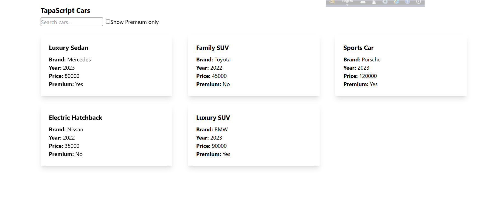

# TapaScript Cars
In this amazing project we will create a simple UI about some car's data but on the way we will understand the react component's basics. Like how to break down the components and other important things.

## How to run this project
If you interested to run this projects on your own local machine. Welcome bro!! here are the step by step guideline to run this project.
you have run following commands only.

```bash
git clone --depth=1 https://github.com/zihad18/Learn-React-with-TapaScript.git

cd Learn-React-with-TapaScript

git sparse-checkout init --cone

git sparse-checkout set Task_2/tapaScript_cars

cd Task_2/tapaScript_cars

```
Then You need to install necessary modules using 
```bash
npm install

```
Then you can run the project 

```bash
npm run dev
```
## UI Design
> 

## Components Breakdown Diagram:
> 
## Components Hierarchy:
> 

## Component Hierarchy in the React Dev Tool:
> 

## Live project